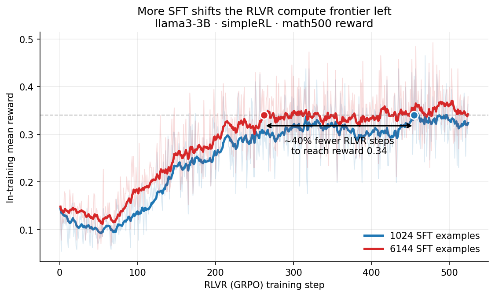

# Balancing the Budget — Optimal SFT for Downstream RL

Code for an in-progress paper studying **optimal SFT training for downstream
RL (DPO / GRPO) under data and compute constraints**: how far to push SFT
before switching to preference- or reward-based post-training, given a fixed data or compute budget.

This repository forks
[mraghav4/balance-budget](https://github.com/mraghav4/balance-budget) — the
code release for *Balancing the Budget: Understanding Trade-offs Between
Supervised and Preference-Based Finetuning* (Raghavendra, Kang, Ritter; arXiv
[2502.11284](https://arxiv.org/pdf/2502.11284)) — and extends it with GRPO /
RLVR and multi-GPU DDP support for the follow-up paper.


### A bit more SFT buys a lot of data and compute for RL



llama3-3B on simpleRL dataset for GRPO. Going from
**1024 → 6144 SFT examples** before GRPO reaches the same in-training mean
reward in **~40% fewer RLVR steps** — up to ~50% less downstream RL compute and data
for a small SFT investment. Curves are EMA-smoothed (α=0.1).

## Install

```bash
uv venv
source .venv/bin/activate
uv pip install -r requirements.txt
```

Add the IFEval [repo](https://github.com/google-research/google-research/tree/master/instruction_following_eval)
in the project root.

## Data

```bash
bash tuning/slurm/data_processing.sh
```

## Run

The unified pipeline trains SFT, snapshots a checkpoint at each pass@k or perplexity
sweetspot target, then post-trains every snapshot. Example with explicit
sweetspot targets for SFT training and downstream GRPO:

```bash
sbatch --gres=gpu:4 tuning/slurm/unified_early_pipeline.sh \
  --model qwen2-2B \
  --wandb-project my_sweep \
  --task-name gsm8k --dataset openmath --sft-dataset openmath \
  --train-size 10000 \
  --sft-passk-targets 0.1 0.2 0.3 0.4 0.5 \
  --monitor-evals gsm8k math500 ifeval \
  --post-training-method grpo --grpo-num-gpus 4 \
  --run-all
```

`--grpo-num-gpus N` launches the GRPO worker under `torchrun
--nproc_per_node=N`, allowing for near linear speedup through DDP.

`--task-name` sets the primary eval that drives sweetspot decisions and
early stopping; `--monitor-evals` adds extra suites logged alongside it.
During GRPO, the pass@k callback reuses `GRPOTrainer`'s in-process
`vllm_generation.llm` engine for both the primary and monitor evals, so
checkpoint evaluation runs without spinning up a separate vLLM server.

## Tests

```bash
pytest tests/
```

## Reference

Original paper:

```bibtex
@misc{raghavendra2025balancingbudgetunderstandingtradeoffs,
      title={Balancing the Budget: Understanding Trade-offs Between Supervised and Preference-Based Finetuning},
      author={Mohit Raghavendra and Junmo Kang and Alan Ritter},
      year={2025},
      eprint={2502.11284},
      archivePrefix={arXiv},
      primaryClass={cs.LG},
      url={https://arxiv.org/abs/2502.11284},
}
```

A follow-up paper on optimal SFT training for downstream RL (DPO / GRPO)
under data and compute constraints is in preparation — citation forthcoming.
